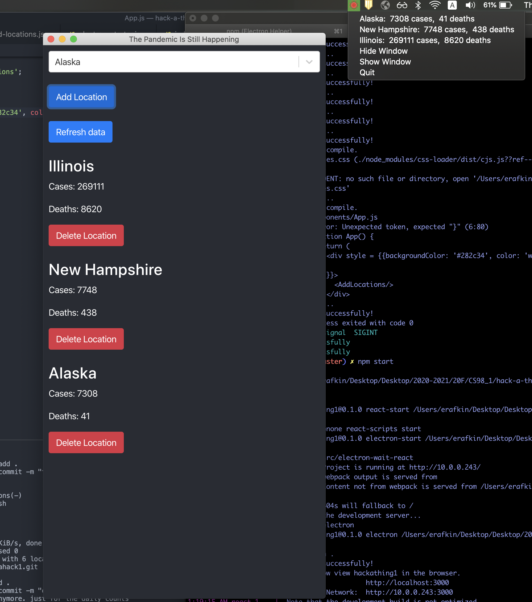

# Hackathing 1
This is a Desktop app built with [Electron](https://www.electronjs.org/) and [React](https://reactjs.org/) that tells the user what the current COVID19 counts are for particular states.
There is also a tray icon which allows you to hide the larger window and still obtain the information about the states that you have selected.

I originally was interested in building a desktop app because I have never done that before. Although I am very familiar with javascript stacks, I thought that electron would be worth taking the time to explore.

After implementing a basic version of this app with plain Electron, I was quickly reminded of why I use react for webdev, normal HTML/CSS/JQuery is really rudimentary and can be very limiting. So I followed some tutorials of how to integrate React with Electron, which made my final product look a lot nicer.  However many of these tutorials contradicted each other, so it took a while to get React to integrate with Electron.

However, I believe that using React with Electron made it much harder to package this app, I was running into a lot of bugs trying to do that and did not end up solving this issue. 

I also ran into issues with permissions in prod. In dev I can write and create files, but this process becomes much harder with a packaged app.

This project showed me the power and limitations of desktop apps. It can be harder to get the different components to talk to each other, but in the end the `ipcRenderer` feature was really helpful for this communication.

Because this is just meant to be a desktop app, I disabled the automatic browser opening on `npm start`. To reenable, change the `start` script in `package.json` to `"start": "react-script start"`.

## Features
This project includes:
- Main Desktop Window
    - Add locations
    - Remove locations
    - Refresh data
- Tray
    - Displays all of your current locations and data
    - Allows you to show and hide the big window
    - Allows you to quit the app
    - Auto refreshes anytime someone adds a location, deletes a location, refreshes the data
## Data 
The data for this app comes from the New York Times opensource covid-19 project. This can be found [here](https://github.com/nytimes/covid-19-data).

I chose to only use the states data rather than the county data so that I could focus on playing with Electron's features rather than fussing with all all the counties.

## Setup
- clone this repo
- run `npm install`
- run `npm start`

## Acknowledgements
This project was setup using:
- `create-react-app` [docs](https://reactjs.org/docs/create-a-new-react-app.html)
- [electron-quick-start](https://github.com/electron/electron-quick-start)

The folowing tutorials were particularly useful:
- [Build a todo app with Electron](https://codeburst.io/build-a-todo-app-with-electron-d6c61f58b55a)
- [Electron tutorial](https://www.tutorialspoint.com/electron/index.htm)
- [Building an Electron application with create-react-app](https://www.freecodecamp.org/news/building-an-electron-application-with-create-react-app-97945861647c/)
- [How To Build an Electron App With ReactJS](https://medium.com/better-programming/how-to-build-an-electron-app-with-reactjs-488fdd532bd4)

The idea for this app came from a CS61 project from 20S created by Emma Rafkin, Thomas Monfre, Anne Bailey, and Rohith Mandavilli. [Frontend repo](https://github.com/tmonfre/cs61-covid19-frontend), [backend repo](https://github.com/tmonfre/cs61-covid19-backend)

